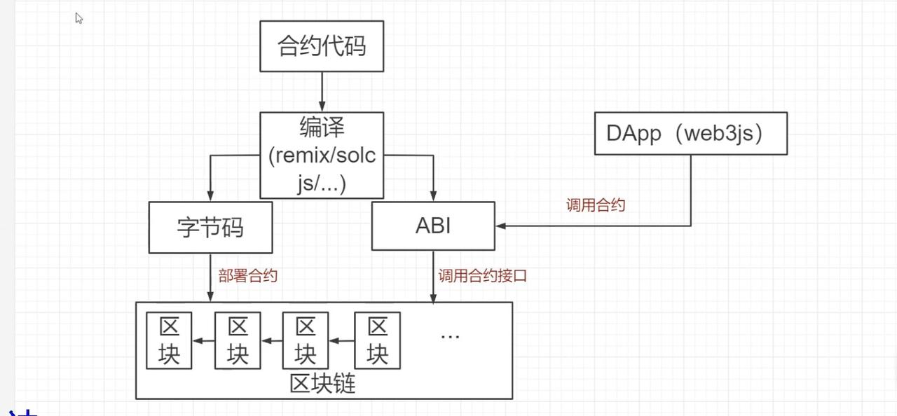
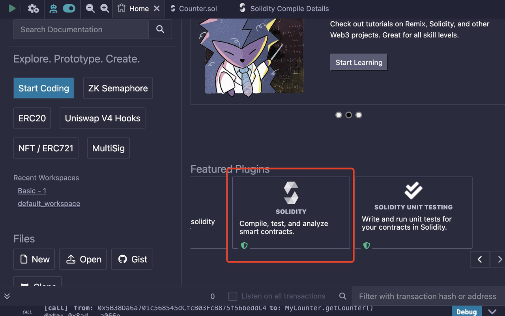
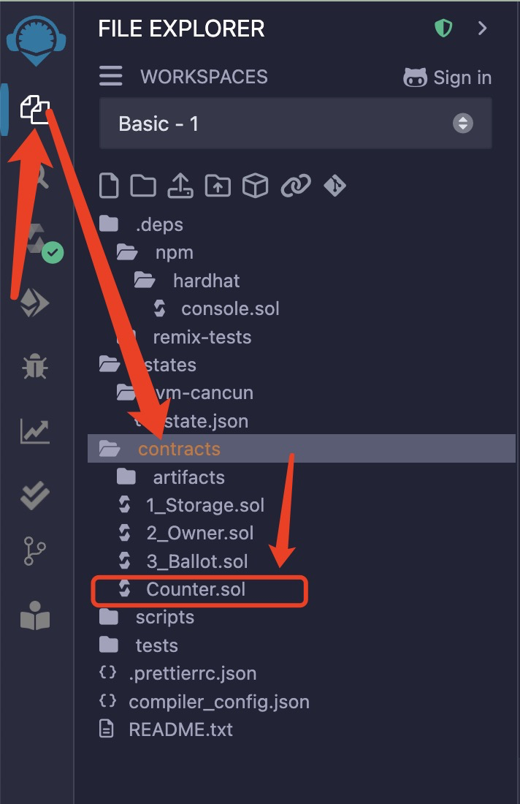
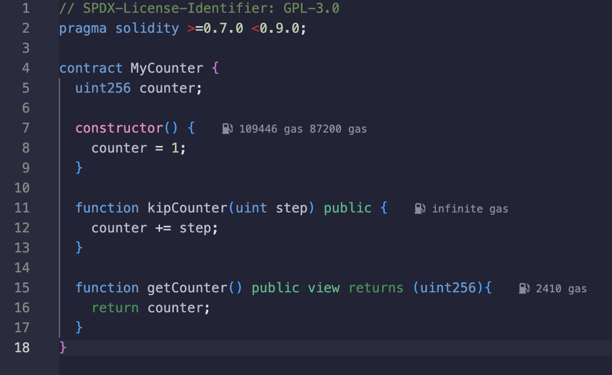
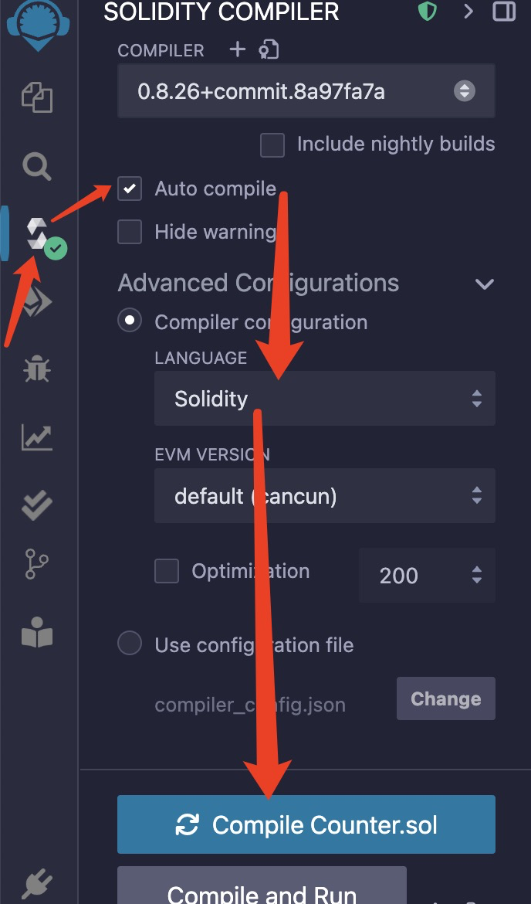
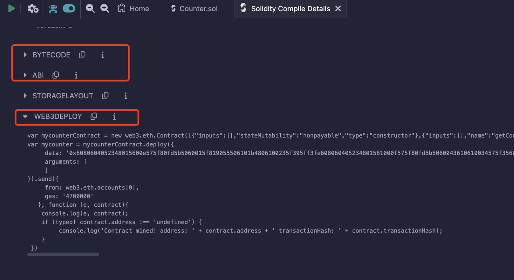
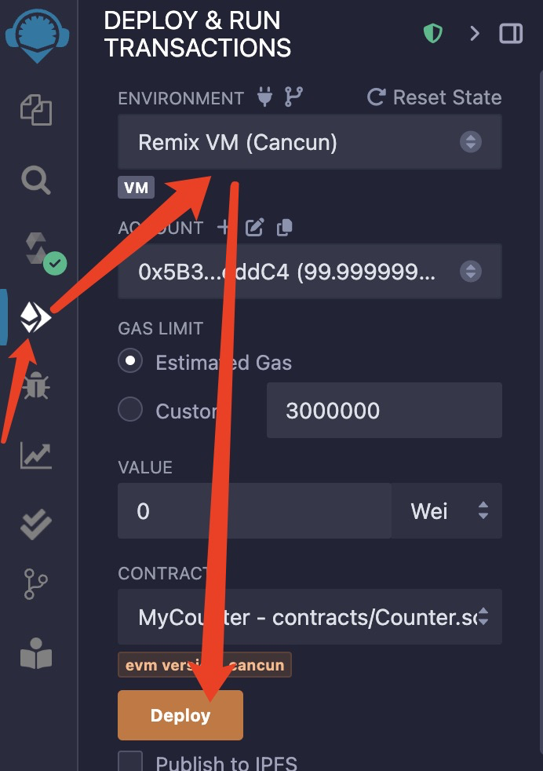
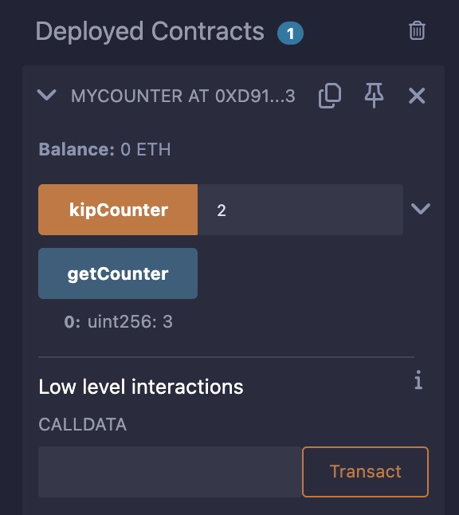
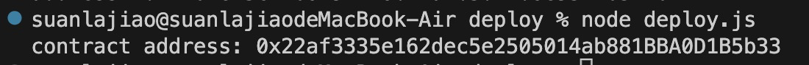

## Dapp的开发之使用Web3部署合约

首先解释一下智能合约，智能合约是一段代码，通过编译器（remix/solcjs）编译成字节码部署到区块链上，然后可以通过Dapp里的web3库 再通过ABI（智能合约编译成的）调用合约上的接口函数进行操作，而这个函数会在区块链上执行。



1. 进入 `https://remix.ethereum.org/`，我们通过这个在线编辑器编辑合约然后编译。
2.  选择`solidity`语言进行编写，`solidity`语言编写的语法可以参考这个中文文档：`https://solidity-cn.readthedocs.io/zh/develop/solidity-by-example.html`。

 

3. 然后我们来编写一个简单的智能合约，点击第一个图标，然后进入contracts文件夹，创建一个counter合约。


4. 按照以下编写即可，注意顶部必须要加 // SPDX-License-Identifier: GPL-3.0，我们定义了一个叫 MyCounter 的合约，然后合约维护的数据是counter，可以通过 kipCounter 添加计数器，也可以通过 getCounter 获取当前的counter数值。

```javascript
// SPDX-License-Identifier: GPL-3.0
pragma solidity >=0.7.0 <0.9.0;

contract MyCounter {
  uint256 counter;

  constructor() {
    counter = 1;
  }

  function kipCounter(uint step) public {
    counter += step;
  }

  function getCounter() public view returns (uint256){
    return counter;
  }
}
```


5. 写完之后，我们就可以进行编译了，按照以下步骤，点击第三个图标，然后勾选自动编译，选择solidity语言，点击Compile Counter.sol，最后点击详情。



6. 最后可以看到这个字节码、ABI、部署代码。
 

7. 如果我们想执行合约，也可以点击第四个图标，选择环境，最后点击deploy。
 

8. 在下方会生成一个部署后的合约，输入2、点击kipCounter它就会执行代码，然后点击getCounter，可以看到下面显示3。

   
9. 进入先前创建的ganache文件夹，在ganache下方创建一个deploy文件夹，然后创建一个deploy.js。
引入web3库，然后把编译详情里的web3Deploy那一栏下方的代码复制过来放到deploy.js，new web3.eth.Contract里是编译生成的ABI，最后还要再改个地方，send里的form参数，设置成ganache给的十个账户其中一个即可。
```javascript
var { Web3 } = require("web3");
var web3 = new Web3("http://localhost:8545");

var mycounterContract = new web3.eth.Contract([
  { inputs: [], stateMutability: "nonpayable", type: "constructor" },
  {
    inputs: [],
    name: "getCounter",
    outputs: [{ internalType: "uint256", name: "", type: "uint256" }],
    stateMutability: "view",
    type: "function",
  },
  {
    inputs: [{ internalType: "uint256", name: "step", type: "uint256" }],
    name: "kipCounter",
    outputs: [],
    stateMutability: "nonpayable",
    type: "function",
  },
]);

var mycounter = mycounterContract
  .deploy({
    // 字节码
    data: "0x6080604052348015600e575f80fd5b5060015f819055506101b4806100235f395ff3fe608060405234801561000f575f80fd5b5060043610610034575f3560e01c80638ada066e14610038578063e24801d814610056575b5f80fd5b610040610072565b60405161004d91906100ac565b60405180910390f35b610070600480360381019061006b91906100f3565b61007a565b005b5f8054905090565b805f8082825461008a919061014b565b9250508190555050565b5f819050919050565b6100a681610094565b82525050565b5f6020820190506100bf5f83018461009d565b92915050565b5f80fd5b6100d281610094565b81146100dc575f80fd5b50565b5f813590506100ed816100c9565b92915050565b5f60208284031215610108576101076100c5565b5b5f610115848285016100df565b91505092915050565b7f4e487b71000000000000000000000000000000000000000000000000000000005f52601160045260245ffd5b5f61015582610094565b915061016083610094565b92508282019050808211156101785761017761011e565b5b9291505056fea2646970667358221220035699d8b06006f54d646a08b3069765b4321d897986c197d6108966b838887c64736f6c634300081a0033",
    arguments: [],
  })
  .send(
    {
      from: '0xB54657bD7744713E0231Ff2C4be185325baEbf7F', //改了这里ganache账户
      gas: "4700000",
    },
    function (e, contract) {
      console.log(e, contract);
      if (typeof contract.address !== "undefined") {
        console.log(
          "Contract mined! address: " +
            contract.address +
            " transactionHash: " +
            contract.transactionHash
        );
      }
    }
  ).then((contract)=>{
    console.log("contract address:", contract._address);
  });
```

10. 最后终端执行 node deploy.js，可以看到部署成功之后的合约地址。
 
