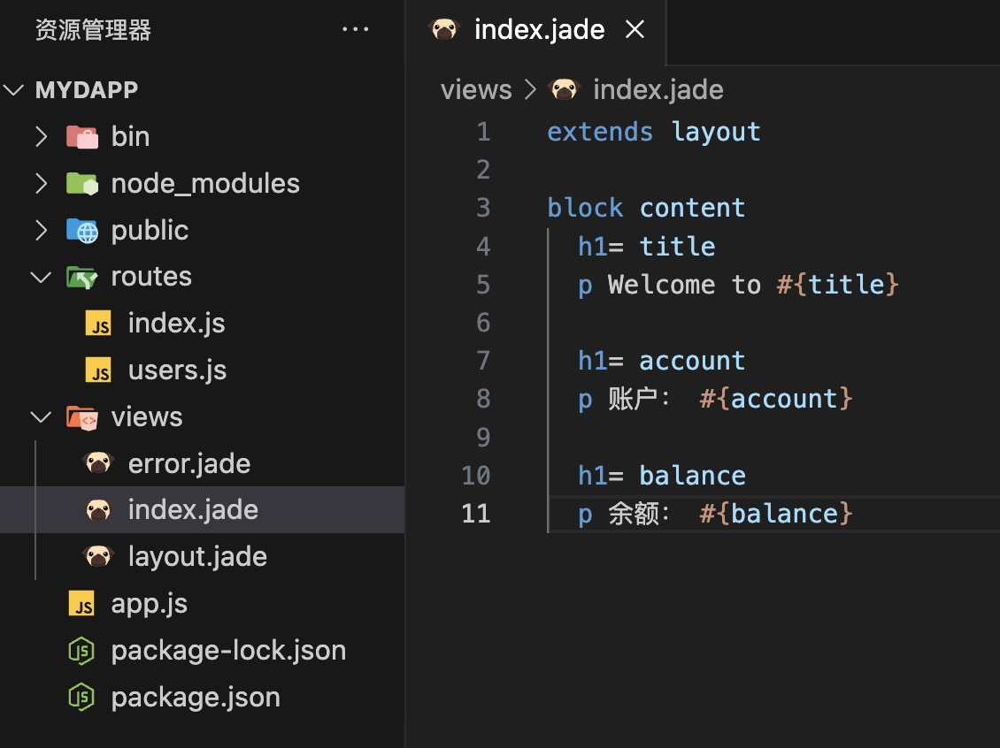
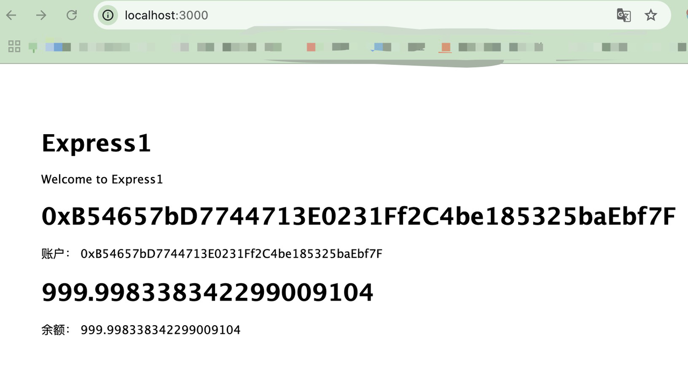

## Dapp的开发之和区块链进行交互


1. 安装`express`
```javacript
npm install express
```

2. 使用`express`创建一个项目，初始化项目，安装web3
```javacript
express MyDapp

npm install

npm i web3
```
3. 进入`routes`下的`index.js`进行修改，引入`web3`，连接区块链。通过web3获取区块链上的账户，我们取第一个账户，然后获取这个账户下的金额，再通过`fromWei`转成`ether`格式，最后通过`render`传入这几个变量渲染到页面上。
```javacript
var express = require("express");
var router = express.Router();

var { Web3 } = require("web3");
var web3 = new Web3("http://localhost:8545");

// web3.eth.getAccounts().then(console.log)

/* GET home page. */
router.get("/", function (req, res, next) {
  web3.eth.getAccounts().then((accounts) => {
    var account = accounts[0];
    web3.eth.getBalance(account).then((balance) => {
      console.log("balance",balance);
      var amount = web3.utils.fromWei(balance, "ether");
      res.render("index", {
        title: "Express1",
        account: account,
        balance: amount,
      });
    });
  });
  // res.render("index", { title: "Express" });
});

module.exports = router;
```

4. 进入views下的index.jade文件，进行如下修改：增加account和balance的显示


5. 最后 npm start，启动 http://localhost:3000，就可以看到页面上展示了账户和金额了。
