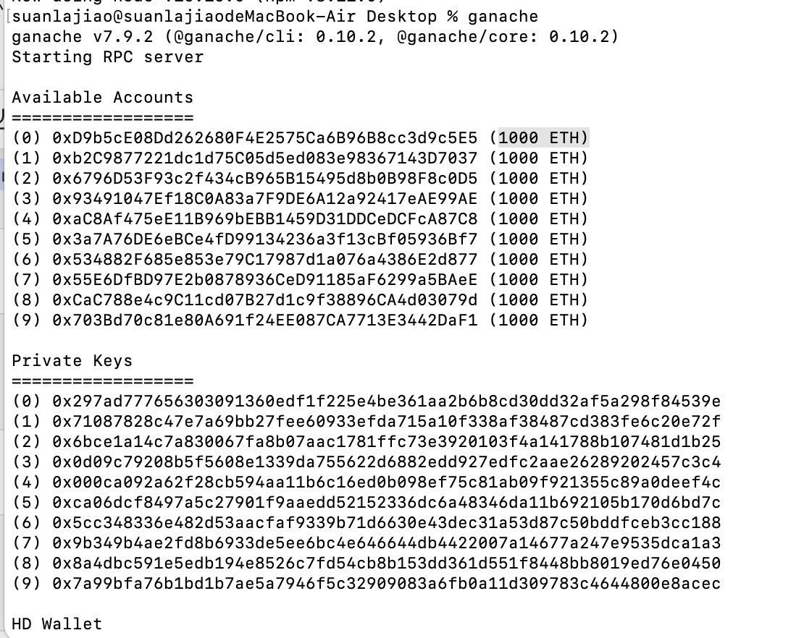
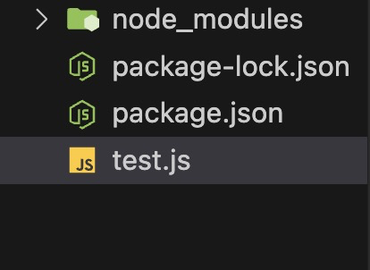

# 区块链
区块链是分布式的，dapp的数据是存放在区块链上的，区块链上有很多节点，就算其中一个被黑客截取，还有其它节点链是完整的，所以安全性相对较高，然后通过web3与区块链进行交互，dapp可以拿到区块链上的数据。

## ganache的使用

**ganache是在本地内存模拟区块链，可以把它当成区块链去使用测试**

1. 安装ganache，详情看：`https://github.com/trufflesuite/ganache`

```javascript
//  Node.js >= v16.0.0 and npm >= 7.10.0.
npm install ganache --global
```

2. 启动，终端命令行输入 `ganache`
```javascript
ganache
```

3. 访问ganache会生成十个账号，并为之分配1000个ETH。



并返回一个访问地址，这是区块链的地址
```javascript
127.0.0.1:8545
```


**这时候我们已经启动了一个区块链，然后就可以建立一个工程连接它。**
1. 创建一个文件夹，名字叫ganache
2. 然后进入终端，安装web3
```javascript
npm i web3 //根据node版本，我本地16的安装的web3是版本4
```
3. 安装之后在根目录创建一个test.js文件



4. 引入web3，通过区块链地址`http://localhost:8545`，连接ganache区块链，连接成功后，通过web3库就可以成功访问区块链上的信息了，还可以访问账户等等。

```javascript
var { Web3 } = require("web3");
var web3 = new Web3("http://localhost:8545");

web3.eth.net
  .isListening()
  .then(() => {
    console.log("Connected to the network");
    web3.eth
      .getNodeInfo()
      .then((nodeInfo) => {
        console.log("Node Info:", nodeInfo); // 这里会返回以太坊节点的信息
      })
      .catch((error) => console.log("Error getting node info:", error));
  })
  .catch((error) => console.log("Failed to connect:", error));

```

5. 终端执行命令 
```javascript
node test.js
```