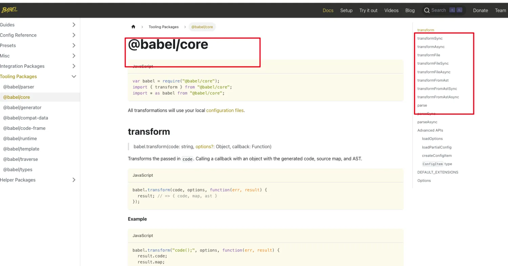

# Babel


## 核心功能
1. 语法转换：将新版本的 JavaScript 语法转换为旧版本的语法   （filter  map）
2. Polyfill：通过引入额外的代码，使新功能在旧浏览器中可用 
比如：（新特性的 比如：promise  object.assign）
3. JSX: 将JSX语法转换成普通的JavaScript语法  (浏览器并不支持 jsx  他支持的是 html js css)
4. 插件: 为Babel提供自定义功能   (可以自定义插件)

## 什么是babel？


Babel 是一个 JavaScript 编译器,提供了JavaScript的编译过程，能够将源代码转换为目标代码。

`AST -> Transform -> Generate`

官网: `https://babeljs.io/`

查看AST:  `https://astexplorer.net/`
(这个网站可以生ES代码的AST语法树)

Babel所有的包: `https://babeljs.io/docs/babel-parser`

常用的就是core 都帮你融合到里面了


## 例子

**1. 语法转换：将新版本的 JavaScript 语法转换为旧版本的语法**

```javascript
pnpm i --save-dev @babel/core @babel/cli @babel/preset-env
```

test.js 测试用例
```javascript
//语法
const a = (params = 1) => 1 + params;
const b = [1, 2]
const c = [...b, 3, 4, 5]
class apple {
}
new apple()
//API
const x = [1, 2, 3, 4, 5, 6, 7, 8, 9, 10].filter((x) => x % 2 === 0)
const y = Object.assign({}, { name: 1 })
```

index.js 核心转换代码，转换之前记得设置package.json的type为module，否则只支持require。

```javascript
import Babel from '@babel/core'
import presetEnv from '@babel/preset-env' // es6-es5的核心包
import fs from 'node:fs'
const code = fs.readFileSync('./test.js', 'utf8')
const result = Babel.transform(code, {
  presets: [presetEnv]
})
console.log(result.code)
```

编译之后的代码
```javascript
"use strict";

function _typeof(o) { "@babel/helpers - typeof"; return _typeof = "function" == typeof Symbol && "symbol" == typeof Symbol.iterator ? function (o) { return typeof o; } : function (o) { return o && "function" == typeof Symbol && o.constructor === Symbol && o !== Symbol.prototype ? "symbol" : typeof o; }, _typeof(o); }
function _defineProperties(e, r) { for (var t = 0; t < r.length; t++) { var o = r[t]; o.enumerable = o.enumerable || !1, o.configurable = !0, "value" in o && (o.writable = !0), Object.defineProperty(e, _toPropertyKey(o.key), o); } }
function _createClass(e, r, t) { return r && _defineProperties(e.prototype, r), t && _defineProperties(e, t), Object.defineProperty(e, "prototype", { writable: !1 }), e; }
function _toPropertyKey(t) { var i = _toPrimitive(t, "string"); return "symbol" == _typeof(i) ? i : i + ""; }
function _toPrimitive(t, r) { if ("object" != _typeof(t) || !t) return t; var e = t[Symbol.toPrimitive]; if (void 0 !== e) { var i = e.call(t, r || "default"); if ("object" != _typeof(i)) return i; throw new TypeError("@@toPrimitive must return a primitive value."); } return ("string" === r ? String : Number)(t); }
function _classCallCheck(a, n) { if (!(a instanceof n)) throw new TypeError("Cannot call a class as a function"); }
var a = function a() {
  var params = arguments.length > 0 && arguments[0] !== undefined ? arguments[0] : 2;
  return 1 + params;
};
var b = [1, 2, 3];
var c = [].concat(b, [4, 5]);
var Babel = /*#__PURE__*/_createClass(function Babel() {
  _classCallCheck(this, Babel);
});
new Babel();
```

主要通过core.js
core.js 的实现原理：比如filter支持吗？
判断原型里面有没有filter   没有的话 帮你实现   Array

如何支持新特性例如 `Object.assign` `Array.prototype.find` 等
```javascript
npm i core-js -D
```

index.js 增强编译
```javascript
import Babel from '@babel/core'
import presetEnv from '@babel/preset-env'
import fs from 'node:fs'
const file = fs.readFileSync('./test.js', 'utf8')
const result = Babel.transform(file, {
  //usage 会根据配置的浏览器兼容，以及你代码中用到的 API 来进行 polyfill，实现了按需添加
  //corejs 3 是corejs的版本
  presets: [
  //usage表示按需引入、entry表示手动引入
    [presetEnv, { useBuiltIns: "usage", corejs: 3 }]
  ]
})
console.log(result.code)
```

转换之后的代码
```javascript
"use strict";

require("core-js/modules/es.symbol.js");
require("core-js/modules/es.symbol.description.js");
require("core-js/modules/es.symbol.iterator.js");
require("core-js/modules/es.symbol.to-primitive.js");
require("core-js/modules/es.array.iterator.js");
require("core-js/modules/es.date.to-primitive.js");
require("core-js/modules/es.number.constructor.js");
require("core-js/modules/es.object.define-property.js");
require("core-js/modules/es.string.iterator.js");
require("core-js/modules/web.dom-collections.iterator.js");
function _typeof(o) { "@babel/helpers - typeof"; return _typeof = "function" == typeof Symbol && "symbol" == typeof Symbol.iterator ? function (o) { return typeof o; } : function (o) { return o && "function" == typeof Symbol && o.constructor === Symbol && o !== Symbol.prototype ? "symbol" : typeof o; }, _typeof(o); }
require("core-js/modules/es.array.concat.js");
require("core-js/modules/es.array.filter.js");
require("core-js/modules/es.object.assign.js");
require("core-js/modules/es.object.to-string.js");
function _defineProperties(e, r) { for (var t = 0; t < r.length; t++) { var o = r[t]; o.enumerable = o.enumerable || !1, o.configurable = !0, "value" in o && (o.writable = !0), Object.defineProperty(e, _toPropertyKey(o.key), o); } }
function _createClass(e, r, t) { return r && _defineProperties(e.prototype, r), t && _defineProperties(e, t), Object.defineProperty(e, "prototype", { writable: !1 }), e; }
function _toPropertyKey(t) { var i = _toPrimitive(t, "string"); return "symbol" == _typeof(i) ? i : i + ""; } 
function _toPrimitive(t, r) { if ("object" != _typeof(t) || !t) return t; var e = t[Symbol.toPrimitive]; if (void 0 !== e) { var i = e.call(t, r || "default"); if ("object" != _typeof(i)) return i; throw new TypeError("@@toPrimitive must return a primitive value."); } return ("string" === r ? String : Number)(t); }
function _classCallCheck(a, n) { if (!(a instanceof n)) throw new TypeError("Cannot call a class as a function"); }
//语法
var a = function a() {
  var params = arguments.length > 0 && arguments[0] !== undefined ? arguments[0] : 2;
  return 1 + params;
};
var b = [1, 2, 3];
var c = [].concat(b, [4, 5]);
var Babel = /*#__PURE__*/_createClass(function Babel() {
  _classCallCheck(this, Babel);
});
new Babel();
//API
var x = [1, 2, 3, 4, 5, 6, 7, 8, 9, 10].filter(function (x) {
  return x % 2 === 0;
});
var y = Object.assign({}, {
  name: 1
});
```

**2. jsx代码转换react**

安装依赖 react react-dom

测试用例 test.jsx
```javascript
import react from 'react'
import { createRoot } from 'react-dom/client'

const App = () => {
  return <div>apple</div>
}

createRoot(document.getElementById('root')).render(<App />)
```
运行一下看一下效果，如果直接运行就会报错 

编写代码 只需要增加一个预设即可 @babel/preset-react
```javascript
npm install @babel/preset-react -D
```

```javascript
import Babel from '@babel/core'
import presetEnv from '@babel/preset-env'
import fs from 'node:fs'
import react from '@babel/preset-react'
const file = fs.readFileSync('./app.jsx', 'utf8')
const result = Babel.transform(file, {
  presets: [
    [presetEnv, { useBuiltIns: "usage", corejs: 3 }],
    react
  ]
})
console.log(result.code) 
```

转换后的结果
`其实是调用了React.createElement去创建元素`

```javascript
"use strict";

var _react = _interopRequireDefault(require("react"));
var _client = require("react-dom/client");
function _interopRequireDefault(e) { return e && e.__esModule ? e : { "default": e }; }
var App = function App() {
  return /*#__PURE__*/React.createElement("div", null, "\u5C0F\u6EE1\u662F\u8C01\uFF1F\uFF1F\uFF1F\uFF1F\uFF1F");
};
(0, _client.createRoot)(document.getElementById('root')).render(/*#__PURE__*/React.createElement(App, null));
```