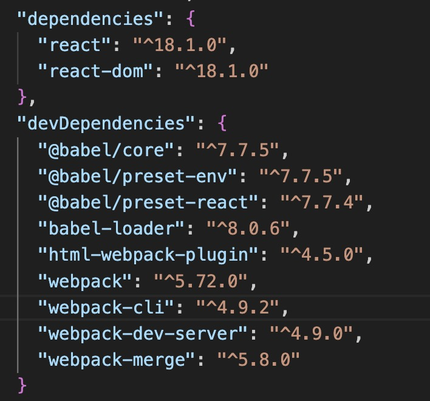

# DllPlugin
不用于生产环境

DllPlugin 是 Webpack 提供的一个插件，用于创建动态链接库（DLL，Dynamic Link Library），以优化 Webpack 构建过程中的性能，特别是对于大型项目的构建速度。比如说，如果你的项目中使用了大量的第三方库（如 Vue、React、ReactDOM 等），这些库体积大构建慢，且比较稳定基本不会升级版本，而这些库在每次构建时都需要被重新编译和打包，这会显著增加构建时间。使用 DllPlugin 可以将这些不经常变化的库预先打包成 DLL 文件，然后在主配置中通过 DllReferencePlugin 引用这些 DLL，从而在构建主项目时不再需要重新编译这些库，可以极大的减少构建时间。

### 项目初始化
1. 新建一个项目webpack-dll-code
2. 安装依赖
   
各个插件的作用就不解释了，可以看之前的文章
3. 在根目录下新建public文件夹，在里面添加一个index.html文件
   index.html
  ```html
   <!DOCTYPE html>
    <html lang="en">
    <head>
        <meta charset="UTF-8">
        <meta name="viewport" content="width=device-width, initial-scale=1.0">
        <meta http-equiv="X-UA-Compatible" content="ie=edge">
        <title>Document</title>
    </head>
    <body>
        <div id="root"></div>
    </body>
    </html>
```
4. 在根目录下新建src文件夹，里面添加一个index.js文件和app.js文件。

    index.js
    ```js
    import React from 'react';

    class App extends React.Component {
    constructor(props) {
        super(props);
    }
    render() {
        return <p>This is App Component. </p>;
    }
    }

    export default App;

    ```
    app.js
    ```js
    import React from 'react';

    class App extends React.Component {
    constructor(props) {
        super(props);
    }
    render() {
        return <p>This is App Component. </p>;
    }
    }

    export default App;
    ```
5. 根目录下新建一个.babelrc文件
```json
{
    "presets": ["@babel/preset-env", "@babel/preset-react"],
    "plugins": []
}
```
### 配置文件
根目录下新建一个文件夹build，里面新建3个配置文件，分别是webpack.common.js、webpack.dev.js
、webpack.dll.js。

webpack.common.js
```js
const path = require('path')
const HtmlWebpackPlugin = require('html-webpack-plugin')
const srcPath = path.join(__dirname, '..', 'src')
const publicPath = path.join(__dirname, '..', 'public');

module.exports = {
    entry: path.join(srcPath, 'index'),
    module: {
        rules: [
            {
                test: /\.js$/,
                use: ['babel-loader'],
                include: srcPath,
                exclude: /node_modules/
            },
        ]
    },
    plugins: [
        new HtmlWebpackPlugin({
            template: path.join(publicPath, 'index.html'),
            filename: 'index.html'
        })
    ]
}
```

wepack.dll.js
```js
const path = require('path');
const DllPlugin = require('webpack/lib/DllPlugin');
const distPath = path.join(__dirname, '..', 'dist')

module.exports = {
  mode: 'development',
  // JS 执行入口文件
  entry: {
    // 把 React 相关模块的放到一个单独的动态链接库
    react: ['react', 'react-dom']
  },
  output: {
    // [name] 代表当前动态链接库的名称，也就是 entry 中配置的 react
    filename: '[name].dll.js',
    path: distPath,
    library: '_dll_[name]',
  },
  plugins: [
    // 接入 DllPlugin
    new DllPlugin({
      name: '_dll_[name]',
      // 描述动态链接库的 manifest.json 文件输出时的文件名称
      path: path.join(distPath, '[name].manifest.json'),
    }),
  ],
}
```

- webpack已经内置了DllPlugin，所以不需要安装额外的插件。
- 设置entry，这里我们想把React相关模块放到一个单独的动态链接库中，所以配置了react: ['react', 'react-dom']。
- 设置输出的动态链接库的文件名称，输出的文件都放到dist目录下，还要设置存放动态链接库的全局变量名称，例如对应的 react 来说就是_dll_react，之所以前面加上_dll_是为了防止全局变量冲突。、
- 在plugins中new DllPlugin，设置name和path属性。这里的name是动态链接库的全局变量名称，需要和 output.library 中保持一致，该字段的值也就是输出的 manifest.json 文件 中 name 字段的值，例如 react.manifest.json 中就有 "name": "_dll_react"。path是描述动态链接库的 manifest.json 文件输出时的文件名称。

webpack.dev.js
```js
const path = require('path')
const webpack = require('webpack')
const { merge } = require('webpack-merge')
const webpackCommonConf = require('./webpack.common.js')
const srcPath = path.join(__dirname, '..', 'src')
const distPath = path.join(__dirname, '..', 'dist')
const DllReferencePlugin = require('webpack/lib/DllReferencePlugin');

module.exports = merge(webpackCommonConf, {
    mode: 'development',
    module: {
        rules: [
            {
                test: /\.js$/,
                use: ['babel-loader'],
                include: srcPath,
            },
        ]
    },
    plugins: [
        new webpack.DefinePlugin({
            ENV: JSON.stringify('development')
        }),

        new DllReferencePlugin({
            manifest: require(path.join(distPath, 'react.manifest.json')),
        }),
    ],
    devServer: {
        port: 8080,
        compress: true,  // 启动 gzip 压缩
        static: {
            directory: './'
        }
    }
})
```

- 引入DllReferencePlugin，告诉Webpack使用了哪些动态链接库。
- 在plugins中 new DllReferencePlugin，设置manifest属性。这里的manifest是描述动态链接库的文件内容，也就是之前输出的react.manifest.json文件的内容。

最后，在index.html引入
```html
<script src="/dist/react.dll.js"></script>
```
在引入之前需要先执行npm run dll，生成动态链接库文件。