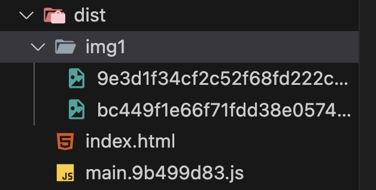

# webpack的基本配置

**1. 新建一个webpack项目**

在你喜欢的目录下新建一个文件夹，比如说叫proctice。


**2. 初始化项目**

```javascript
npm init
```

安装 webpack webpack-cli webpack-dev-server webpack-merge

```javascript
npm i webpack webpack-cli webpack-dev-server webpack-merge --save-dev
```
- webpack: 构建工具。
- webpack-cli: webpack的命令行工具。
- webpack-dev-server: 提供一个简单的web服务器，并且自动刷新浏览器。
- webpack-merge: 合并多个配置文件。

**3. 创建webpack的配置文件**

webpack的配置文件是`webpack.config.js`，它是一个Node.js的模块，需要通过CommonJS的`module.exports`导出。通常在一个项目中，需要有不同环境的配置文件，比如说开发环境、生产环境的配置文件，还有公共配置文件。所以，在proctice根目录下新建一个base-config的文件夹，在里面新建 `webpack.dev.js`、`webpack.prod.js`、`webpack.common.js` 三个文件。我们先不着急写配置。

**4. 根目录下新建src文件夹**

- 一般我们会把项目的页面入口文件放在src目录下，比如说叫`index.js`；在index.js文件中，我们引入了样式文件、图片资源以及一个自定义的模块 `math`；
  
```javascript
import './style/style.css';
import './style/style.less';
import webp from './assets/back.png';
import png from './assets/head.png';
import { sum } from './math';

const sumRes = sum(10, 10);     
console.log('sumRes', sumRes);

function insertImage(url) {
  const image = new Image();
  image.src= url;
  document.body.appendChild(image);
}

insertImage(webp);
insertImage(png);
```

  math.js
```javascript
export const sum = (a, b) => {
    return a + b;
}
export const cheng = (a, b) => {
    return a * b;
}
```

- 然后我们要显示一个页面来展示我们的项目，比如说叫`index.html`；
```html
<!DOCTYPE html>
<html lang="en">
<head>
    <meta charset="UTF-8">
    <meta name="viewport" content="width=device-width, initial-scale=1.0">
    <meta http-equiv="X-UA-Compatible" content="ie=edge">
    <title>base</title>

</head>
<body>
    <p>webpack5 demo</p>
</body>
</html>
```
- 在创建了HTML文件后，为了美化页面，我们需要在src目录下新建一个名为style的文件夹，用于存放所有的样式文件，在style下新建两个文件，`style.less`、`style.css`；

style.less
```less
p {
  color: blue;
  font-size: 36px;
 }
```
  style.css
  ```css
  body {
    background-color: #f1f1f1;
  }

  p {
      transform: rotate(-45deg);
  }
  ```
- 此外，项目中往往还需要展示图片等静态资源，因此，在src目录下新建一个名为assets的文件夹，专门用于存放这些静态资源图片，有助于项目的资源管理和维护；
  


**5. 编写webpack的配置文件**

接下来我们就需要写webpack配置文件，对以上这些资源进行处理、编译、打包。

首先编写dev环境的配置，导入webpack-merge插件合并当前配置和公共配置

webpack.dev.js
```javascript
//导入路径
const path = require("path");
const webpack = require("webpack");
const webpackCommonConf = require("./webpack.common.js");
const { merge } = require("webpack-merge");

module.exports = merge(webpackCommonConf, {
  mode: "development",
  module: {
    rules: [
      {
        test: /\.(png|jpg|jpeg|gif|webp)$/,
        // 把代码中引用的图片文件拷贝到 Webpack 构建输出的文件夹中，并返回新的图片路径，且生成一个文件hash值，每次文件内容发生变化时，文件名都会变化，帮助避免浏览器缓存问题。
        use: "file-loader",
      },
    ],
  },
  plugins: [
    //webpack.DefinePlugin 是 Webpack 提供的一个插件，它用于在编译时定义全局常量，这些常量会在代码中被替换掉
    new webpack.DefinePlugin({
      ENV: JSON.stringify("development"),
    }),
  ],
  devServer: {
    port: 8080, //启动服务端口 8080
    open: true, // 自动打开浏览器
    client: {  //控制台显示编译进度条
      progress: true,
    },
    compress: true, // 启动 gzip 压缩
  },
});
```
webpack.common.js
```javascript
const path = require("path");
// __dirname 是 Node.js 中的一个全局变量，它表示当前模块文件所在的目录的绝对路径,
// 当前打印值为：/Users/suanlajiao/Documents/我自己的项目/webpack/proctice/base-config
const srcPath = path.join(__dirname, "..", "src");
const HtmlWebpackPlugin = require("html-webpack-plugin");

module.exports = {
  // 构建的入口文件，index.js，webpack将从这个文件开始分析依赖关系，并执行loder生成ast语法树，然后根据ast生成代码。
  entry: path.join(srcPath, "index"),
  module: {
    rules: [
      {
        test: /\.js$/,
        use: [
          {
            loader: "babel-loader",
          },
        ],
        include: srcPath,
        // exclude: /node_modules/
      },
      {
        test: /\.css$/,
        // loader 的执行顺序是：从后往前，先执行 postcss-loader，然后是 css-loader，最后才是 style-loader。
        use: ["style-loader", "css-loader", "postcss-loader"],
      },
      {
        test: /\.less$/i,
        use: [
          // compiles Less to CSS
          "style-loader",
          "css-loader",
          "less-loader",
        ],
      },
    ],
  },
  plugins: [
    // 生成一个html文件，并把打包生成的js自动引入到这个html文件中。
    //每个入口都要new HtmlWepbackPlugin 生成一个html文件
    new HtmlWebpackPlugin({
      template: path.join(srcPath, "index.html"),
      filename: "index.html",
    }),
  ],
};
```
以上，我们主要针对图片和js、css、less文件做了处理。
- 使用`file-loader`对图片进行打包，把代码中引用的图片文件拷贝到 Webpack 构建输出的文件夹中，并返回新的图片路径，且生成一个文件hash值，每次文件内容发生变化时，文件名都会变化，帮助避免浏览器缓存问题；
- 使用`babel-loader`对`js`进行转译，使其兼容低版本浏览器，注意：除了`babel-loader`还需要安装`@babel/core`、`@babel/preset-env` 两个插件,
  
  `babel-loader` 本身并不包含转译规则，它只是一个桥梁，用来让 Webpack 调用 Babel 进行转译，`@babel/core`是 Babel 的核心部分，负责实际的转译操作，`@babel/preset-env`是一个预设，帮助你根据目标环境（浏览器或 Node.js 版本）来转译代码，确保兼容低版本浏览器。

  安装之后还需要在项目的根目录下创建一个`.babelrc`文件，在里面配置转译规则:
  ```json
  {
    "presets": [
        "@babel/preset-env"
    ],
    "plugins": []
  }
  ```

  另外，babel的配置文件有两种方式:


- 使用postcss-loader、css-loader、style-loader和对css进行处理；
    这个流程是先将css文件`postcss-loader`进行编译、添加浏览器前缀等，然后通过`css-loader`将css文件转换成js模块，最后`style-loader`将这些样式注入到页面的head标签中。

    postcss需要安装三个插件 postcss、postcss-loader、postcss-preset-env。

    安装之后还需要在项目的根目录下创建一个`postcss.config.js`文件，在里面配置转译规则:

    ```javascript
    module.exports = {
      plugins: [require("postcss-preset-env")],
    }
    ```

     具体配置： `https://webpack.docschina.org/loaders/postcss-loader/`

     package.json中配置：
     ```json
    "browserslist": {
    "development": [
      "last 1 chrome version",
      "last 1 firefox version",
      "last 1 safari version"
    ],
    "production": [
      ">0.2%",
      "not dead",
      "not op_mini all"
    ]
  }
  ```
- less-loader、css-loader、style-loader和对css进行处理。
  
    首先less-loader将less文件成css，然后css-loader的作用呢，就是将css中的url和@import等转换成require，将 CSS 作为模块引入并返回一个字符串表示的 CSS 内容，最后style-loader将样式注入到页面的内联样式中。


然后是webpack.prod.js的配置,与dev环境配置的区别是，图片打包使用了url-loader，它会根据图片大小决定是直接转成base64格式的图片还是打包到img目录下。

```javascript
const path = require('path')
const webpack = require('webpack')
const { CleanWebpackPlugin } = require('clean-webpack-plugin');
const { merge } = require('webpack-merge');
const webpackCommonConf = require('./webpack.common.js')
const distPath = path.join(__dirname, '..', 'dist');
module.exports = merge(webpackCommonConf, {
    mode: 'production',
    output: {
      // name根据entry配置的名称来
      // hash是根据内容生成的，取八个字符，帮助浏览器缓存控制，如果文件内容没有变化，hash值就不会变，浏览器就会使用缓存
        filename: '[name].[contenthash:8].js',
        path: distPath,
       // publicPath: 'http://cdn.abc.com'  // 修改所有静态文件 url 的前缀（如 cdn 域名），这里暂时用不到
    },
    module: {
        rules: [
            // 图片 - 考虑 base64 编码的情况  
            {
                test: /\.(png|jpg|jpeg|gif)$/,
                use: {
                    loader: 'url-loader',
                    options: {
                        // 小于 12kb 的图片用 base64 格式产出
                        // 否则，依然延用 file-loader 的形式，产出 url 格式
                        limit: 12 * 1024,

                        // 打包到 img 目录下
                        outputPath: 'img1',

                        // 设置图片的 cdn 地址（也可以统一在外面的 output 中设置，那将作用于所有静态资源）
                        // publicPath: 'http://cdn.baidu.com'
                    }
                }
            },
        ]
    },
    plugins: [
        new CleanWebpackPlugin(), // 每次构建会默认清空 output.path 文件夹
        new webpack.DefinePlugin({
            ENV: JSON.stringify('production')
        })
    ]
})
```

**6. 编写package.json**
```json
 "scripts": {
    "test": "echo \"Error: no test specified\" && exit 1",
    "devBuild": "webpack --config base-config/webpack.dev.js",
    "dev": "webpack serve --config base-config/webpack.dev.js",
    "build": "webpack --config base-config/webpack.prod.js"
  },
```

**7. 运行项目**
```javascript
npm run dev
```
本地环境打包
```javascript
npm run devBuild
```


正式环境打包
```javascript
npm run build
```


注意：这种打包方式不会产生css文件，css模块会被打包到了index.js中，如果想生成单独的css文件，可以使用`mini-css-extract-plugin`插件。后面会讲到。

mode设置production模式，会自动对index.js和index.html进行压缩。

另外：对于dev环境来说，webpack 在没有显式设置 output 配置的情况下，会默认将打包的文件输出到 dist 目录。具体来说，webpack 会使用默认的输出设置，输出文件名通常为 main.js。那如何让webpack输出index.js呢，可以重新配置一下entry，将 entry 配置改为对象形式，并指定一个明确的入口名称即可。
```javascript
entry: {
  index: path.join(srcPath, "index")
}
```