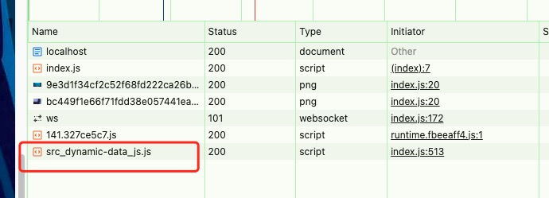
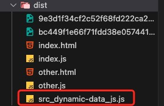
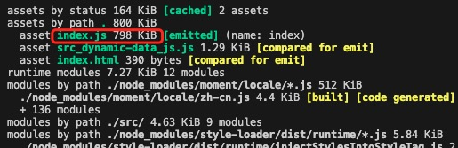
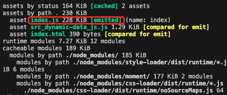
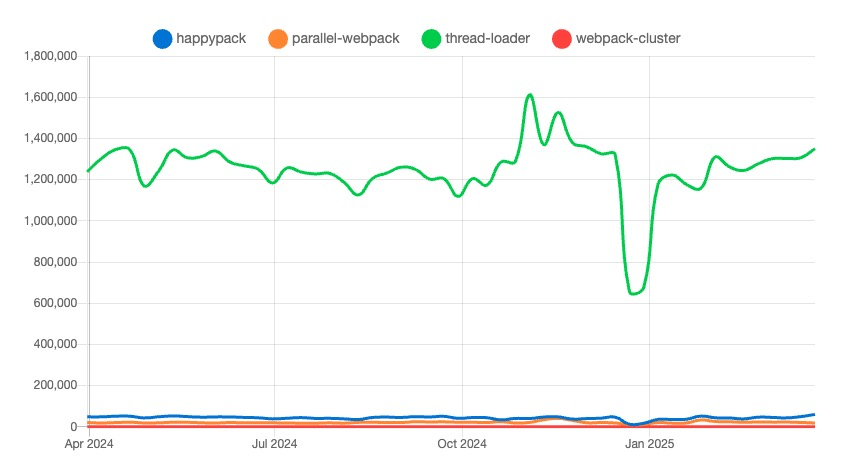
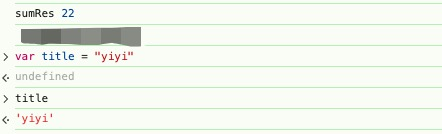
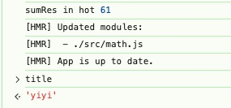

# webpack 的构建优化
## 异步处理 js文件

src根目录下添加一个js文件命名为dynamic-data
```js
export default {
    message: 'this is dynamic data'
}
```

在index.js中引入动态引入dynamic-data
```js
// 引入动态数据 懒加载
setTimeout(()=> {
    // Vue React
    import('./dynamic-data.js').then(res => {
        console.log(res.default.message);  // 注意这里的default
    })
}, 1500);
```

运行结果：



1.5s后它会异步加载`dynamic-data.js`

打包结果，会形成一个独立的chunk：



## babel-loader的缓存（可用于生产环境）
开启缓存 在babel-loader后面添加 cacheDirectory。编译比较耗费性能，开启之后只要代码没有更改，就不会再编译一次，直接取缓存。可以通过include或者exclude明确范围。
```js
moudle: {
    rules: [
        {
            test: /\.js$/,
            use: ['babel-loader?cacheDirectory'],
            include: srcPath,
        },
    ]
}

```

## IgnorePlugin（可用于生产环境）
例如我们要引入moment库，它支持很多种语言，直接引入会默认引入所有语言js代码，体积过大。
```js
import moment from 'moment';
import 'moment/locale/zh-cn'
moment.locale('zh-cn');
```

我们只需要引入中文语言包，可以使用IgnorePlugin忽略掉其他语言包。
```js
// webpack.config.js
const webpack = require('webpack');

module.exports = {
    // ...
    plugins: [
        new webpack.IgnorePlugin({
            resourceRegExp: /^\.\/locale$/,
            contextRegExp: /moment/,
        }),
    ]
}
```

打包结果：

引入 `IgnorePlugin` 前  `index.js` 的大小



引入 `IgnorePlugin` 之后 `index.js` 的大小



## noParse（可用于生产环境）
min.js这种文件已经是处理过的，不需要webpack再进行处理打包
```js
module: {
    noParse: /min\.js/,
    rules:[]
}
```

noParse和IgnorePlugin对比：
- noParse直接不打包，IgnorePlugin只是不打包对应的文件，但是会打包其他文件
- noParse只能用于文件，IgnorePlugin可以用于文件夹和正则表达式

## HappyPack｜thread-loader（可用于生产环境）

`webpack` 默认是单线程的，`HappyPack` 可以将一些任务分配到多个子进程中去执行，从而实现并行化构建 提高打包速度。`thread-loader` 通过多线程来加速 loader 的执行来提高打包速度。`HappyPack` 与webpack4更兼容，`thread-loader`与webpack5完美兼容。如果你使用的是webpack5，推荐使用`thread-loader`。

下面是近一年的这几个优化webpack构建工具的使用情况，可以看到thread-loader使用率比其它几个高很多很多。


HappyPack的配置
```js
const HappyPack = require('happypack');
module.exports = {
  module: {
    rules: [
      {
        test: /\.js$/,
        use: ['happypack/loader?id=babel'],
      },
    ],
  },
  plugins: [
    new HappyPack({
      // 用唯一的标识符 id 来代表当前的 HappyPack 是用来处理一类特定的文件
      id: "babel",
      // 如何处理 .js 文件，用法和 Loader 配置中一样
      loaders: ["babel-loader?cacheDirectory"],
    }),
  ],
};
```
thread-loader的配置，它还可以传递选项，具体查看官网，根据情况选择使用。`https://webpack.docschina.org/loaders/thread-loader/`
```js
module.exports = {
  module: {
    rules: [
      {
        test: /\.js$/,
        include: path.resolve('src'),
        use: [
          "thread-loader",
          "babel-loader"
        ],
      },
    ],
  },
};
```

`关于开启多进程打包注意：`
如果项目比较大，打包比较慢，开启多进程打包可以提升构建速度。但是如果项目比较小，开启多进程打包反而会增加构建时间，因为进程的启动和通信也是需要时间的。总结：按需使用！

## ParallelUglifyPlugin｜TerserWebpackPlugin（用于生产环境）
`ParallelUglifyPlugin` 是一个并行处理的插件，基于 UglifyJS 进行 JavaScript 压缩。它通过多核并行处理加速 UglifyJS 的执行，能够提高压缩效率。不过这个插件已被逐步淘汰，因为它是基于UglifyJS，对ES6+的一些新特性不支持，webpack5更推荐使用TerserWebpackPlugin，它是基于 terser，默认启用并行压缩。 这俩工具只适合放在生产环境prod下用，开发环境没有必要。
```js
// webpack.prod.js
const ParallelUglifyPlugin = require('webpack-parallel-uglify-plugin')

{
    plugins: [
        new ParallelUglifyPlugin({
            // 传递给 UglifyJS 的参数
            // （还是使用 UglifyJS 压缩，只不过帮助开启了多进程）
            uglifyJS: {
                output: {
                    beautify: false, // 最紧凑的输出
                    comments: false, // 删除所有的注释
                },
                compress: {
                    // 删除所有的 `console` 语句，可以兼容ie浏览器
                    drop_console: true,
                    // 内嵌定义了但是只用到一次的变量
                    collapse_vars: true,
                    // 提取出出现多次但是没有定义成变量去引用的静态值
                    reduce_vars: true,
                }
            }
        })
    ]
}
```

```js
const TerserPlugin = require('terser-webpack-plugin');

module.exports = {
  optimization: {
    minimize: true,
    minimizer: [
      new TerserPlugin({
        parallel: true,  // 启用并行压缩
        terserOptions: {
          output: {
            beautify: false, 
            comments: false,  // 删除所有注释
          },
          compress: {
            drop_console: true, 
            collapse_vars: true, 
            reduce_vars: true, 
          },
        },
      }),
    ],
  },
};
```

## 自动刷新｜热更新
**两者的区别**

自动刷新：当更改代码之后点击保存，整个网页会全部刷新，速度较慢，且状态会丢失。

热更新：新代码生效，但网页不刷新，状态也不会丢失。

自动刷新的配置，如果使用了devServer就不需要配置了。热更新的话使用vue-cil创建的项目会自动开启热更新。

webpack 热更新的基本配置：需要更改三个地方 entry、plugins、devServer.hot。
```js
module.exports = merge(webpackCommonConf, {
  mode: "development",
  entry: {
    index: [
      "webpack-dev-server/client?http://localhost:8080/",
      "webpack/hot/dev-server",
      path.join(srcPath, "index"),
    ],
  },

  plugins: [
    new webpack.HotModuleReplacementPlugin(),
  ],

  devServer: {
    open: true, 
    client: {
      progress: true,
    },
    compress: true, 
    hot: true  //这里要配置成true
  },
}
)
```
另外还需要指定哪些模块开启热更新，例如指定math模块开启

index.js
```js
import { sum } from './math';

const sumRes = sum(10, 10);     
console.log('sumRes', sumRes);

// 增加，开启热更新之后的代码逻辑
if (module.hot) {
    module.hot.accept(['./math'], () => {
        const sumRes = sum(10, 50)
        console.log('sumRes in hot', sumRes)
    })
}
```

math.js
```js
export const sum = (a, b) => {
    return a + b + 2;
}
```

运行项目，可以看到控制台打印出了22，在控制台我还定义了一个变量，后面用来测试页面是否有刷新。



这时候更改math.js文件，可以看到控制台打印出了61，且title还是原来的值，说明页面没有刷新，状态没有丢失。

math.js
```js
export const sum = (a, b) => {
    return a + b + 1;
}
```
