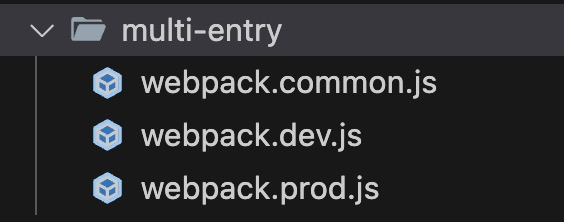
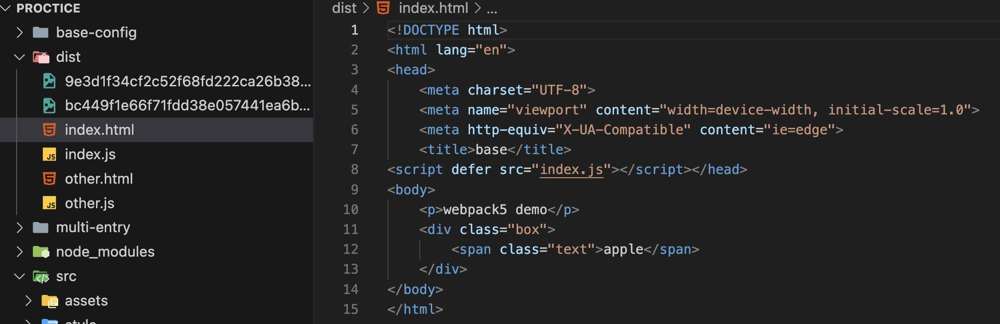

# webpack的高级配置之多入口打包

**1. 在proctice根目录下新建一个文件夹命名为multi-entry**

同样创建三个配置文件pack.config.js、webpack.dev.js、webpack.prod.js。


**2. src下新增两个文件`other.html`和`other.js`**

other.html
```html
<!DOCTYPE html>
<html lang="en"> 
<head>
    <meta charset="UTF-8">
    <meta name="viewport" content="width=device-width, initial-scale=1.0">
    <meta http-equiv="X-UA-Compatible" content="ie=edge">
    <title>other page</title>
</head>
<body>
    <p>other page</p>
</body>
</html>
```

other.js
```js
import { sum } from './math'

const sumRes = sum(10, 20)
console.log('sumRes', sumRes)

console.log('other page')
```

**3. 修改webpack配置文件，使其支持多入口打包。**

**webpack.common.js文件：** 
- entry新增一个入口 `other.js`
```js
entry: {
    index: path.join(srcPath, "index"),
    other: path.join(srcPath, "other"),
  },
```
- plugins新增一个HtmlWebpackPlugin插件，引入other.html， 并为每个入口单独设置最终要引入的chunk文件，因为后面会生成两个chunk文件，如果不设置默认全都引入。
```js
plugins: [
    new HtmlWebpackPlugin({
      template: path.join(srcPath, "index.html"),
      filename: "index.html",
      // chunks 表示该页面要引用哪些 chunk （即上面的 index 和 other），默认全部引用
      chunks: ['index']  // index是entry的key值，表示只引用index.js文件
    }),
    new HtmlWebpackPlugin({
      template: path.join(srcPath, "other.html"),
      filename: "other.html",
      chunks: ['other']
    }),
  ],
```

**4. 修改scripts脚本**
```json
 "scripts": {
    "test": "echo \"Error: no test specified\" && exit 1",
    "devBuild": "webpack --config multi-entry/webpack.dev.js",
    "dev": "webpack serve --config multi-entry/webpack.dev.js",
    "build": "webpack --config multi-entry/webpack.prod.js"
  },
```

**5. 运行打包命令，查看结果。**

运行`npm run devBuild`打包命令，查看dist目录下生成的文件。

