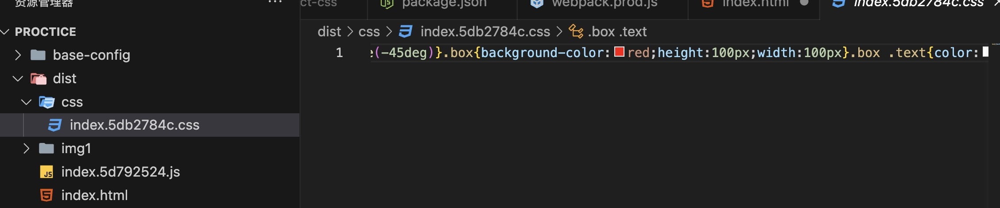
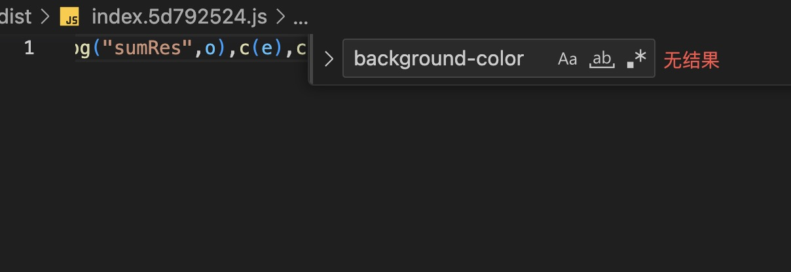

# webpack的高级配置之抽离业务css

因为在之前的文章中，我们已经实现了webpack的打包配置。但是，在打包的过程中，我们发现所有的css样式都被打包到了index.js中，我们希望能将CSS和 JavaScript 分离，浏览器可以缓存 CSS 文件，减少每次访问时的请求负担。

**在proctice根目录下新建一个文件夹命名为min-extract-css**

同样创建三个配置文件webpack.common.js、webpack.dev.js、webpack.prod.js。

webpack.commom.js去掉css的配置
```js
const path = require("path");
// __dirname 是 Node.js 中的一个全局变量，它表示当前模块文件所在的目录的绝对路径
const srcPath = path.join(__dirname, "..", "src");
const HtmlWebpackPlugin = require("html-webpack-plugin");

module.exports = {
  entry: {
    index: path.join(srcPath, "index")
  },
  module: {
    rules: [
      {
        test: /\.js$/,
        use: [
          {
            loader: "babel-loader",
          },
        ],
        include: srcPath,
      },
    ],
  },
  plugins: [
    new HtmlWebpackPlugin({
      template: path.join(srcPath, "index.html"),
      title: "base",
      filename: "index.html",
    }),
  ],
};
```

将css的编译放到dev和prod中分别配置

webpack.dev.js，css的处理跟以前一样
```js
 const path = require("path");
const webpack = require("webpack");
const webpackCommonConf = require("./webpack.common.js");
const { merge } = require("webpack-merge");

module.exports = merge(webpackCommonConf, {
  mode: "development",
  module: {
    rules: [
      // 直接引入图片 url
      {
        test: /\.(png|jpg|jpeg|gif|webp)$/,
        use: "file-loader",
      },
      {
        test: /\.css$/,
        // loader 的执行顺序是：从后往前
        use: ["style-loader", "css-loader", "postcss-loader"], // 加了 postcss  需要配置postcss.config.js
      },
      {
        test: /\.less$/i,
        use: [
          // compiles Less to CSS
          "style-loader",
          "css-loader",
          "less-loader",
        ],
      },
    ],
  },
  plugins: [
    new webpack.DefinePlugin({
      ENV: JSON.stringify("development"),
    }),
  ],
  devServer: {
    port: 8080,
    open: true, // 自动打开浏览器
    client: {
      progress: true,
    },
    compress: true, // 启动 gzip 压缩
  },
});
```
webpack.prod.js
```js
const path = require("path");
const webpack = require("webpack");
const { CleanWebpackPlugin } = require("clean-webpack-plugin");
const { merge } = require("webpack-merge");
const webpackCommonConf = require("./webpack.common.js");
const distPath = path.join(__dirname, "..", "dist");

const MiniCssExtractPlugin = require("mini-css-extract-plugin");
// optimize-css-assets-webpack-plugin已被webpack5弃用
const cssMinimizerPlugin = require("css-minimizer-webpack-plugin");

module.exports = merge(webpackCommonConf, {
  mode: "production",
  output: {
    filename: "[name].[contenthash:8].js",
    path: distPath,
    // publicPath: 'http://cdn.abc.com'  // 修改所有静态文件 url 的前缀（如 cdn 域名），这里暂时用不到
  },
  module: {
    rules: [
      // 图片 - 考虑 base64 编码的情况
      {
        test: /\.(png|jpg|jpeg|gif)$/,
        use: {
          loader: "url-loader", // file-loader
          options: {
            // 小于 12kb 的图片用 base64 格式产出
            // 否则，依然延用 file-loader 的形式，产出 url 格式
            limit: 12 * 1024,

            // 打包到 img 目录下
            outputPath: "/img1/",

            // 设置图片的 cdn 地址（也可以统一在外面的 output 中设置，那将作用于所有静态资源）
            // publicPath: 'http://cdn.baidu.com'
          },
        },
      },
      // 抽离 css
      {
        test: /\.css$/,
        use: [
          MiniCssExtractPlugin.loader, // 注意，这里不再用 style-loader
          "css-loader",
          "postcss-loader",
        ],
      },
      // 抽离 less --> css
      {
        test: /\.less$/,
        use: [
          MiniCssExtractPlugin.loader, // 注意，这里不再用 style-loader
          "css-loader",
          "less-loader",
          "postcss-loader",
        ],
      },
    ],
  },
  plugins: [
    new CleanWebpackPlugin(), // 会默认清空 output.path 文件夹
    new webpack.DefinePlugin({
      ENV: JSON.stringify("production"),
    }),
    // 抽离 css 文件
    new MiniCssExtractPlugin({
      filename: "css/[name].[contenthash:8].css",
    }),
  ],
  optimization: {
    // 压缩 css
    minimizer: [new cssMinimizerPlugin({})],
  },
});
```

新增mini-css-extract-plugin、css-minimizer-webpack-plugin插件，用于生产环境抽离css文件和压缩css。

在plugins中添加MiniCssExtractPlugin插件，用于抽离css文件，同时配置最终输出的路径和名称。再将rules中的style-loader替换为MiniCssExtractPlugin.loader，这样就不会将css文件打包到js文件中，而是单独打包成css文件。

**修改scripts脚本**
```json
 "scripts": {
    "test": "echo \"Error: no test specified\" && exit 1",
    "devBuild": "webpack --config min-extract-css/webpack.dev.js",
    "dev": "webpack serve --config min-extract-css/webpack.dev.js",
    "build": "webpack --config min-extract-css/webpack.prod.js"
  },
```

**运行项目**
```js
npm run build
```

**打包结果**


可以看到，css文件被单独打包出来并压缩了，文件名中包含了contenthash，这样在文件内容发生变化时，文件名也会发生变化，从而避免浏览器缓存问题。

查看index.js，发现已无css代码



最终生成的html中 css也采用了link标签引入css文件

```html
<!DOCTYPE html>
<html lang="en">
  <head>
    <meta charset="UTF-8" />
    <meta name="viewport" content="width=device-width,initial-scale=1" />
    <meta http-equiv="X-UA-Compatible" content="ie=edge" />
    <title>base</title>
    <script defer="defer" src="index.5d792524.js"></script>
    <link href="css/index.5db2784c.css" rel="stylesheet" />
  </head>
  <body>
    <p>webpack5 demo</p>
    <div class="box"><span class="text">apple</span></div>
  </body>
</html>
```