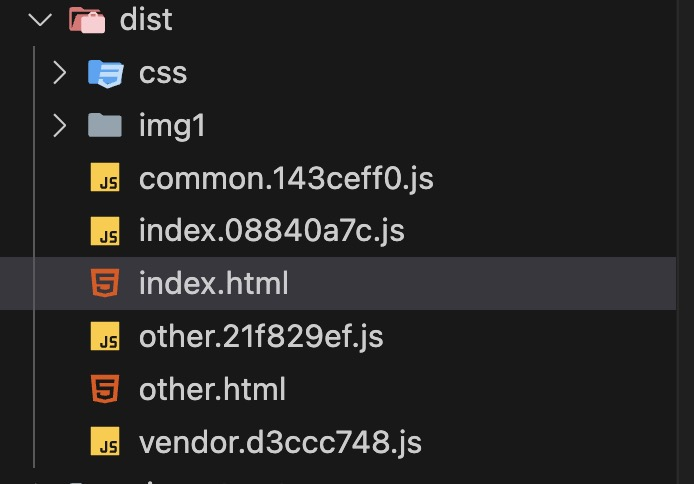

# webpack高级配置之抽离公共代码

当我们修改业务代码时，contenthash 会发生变化，但对于第三方库而言，代码通常是不变的。如果多个模块都引入了相同的第三方库，而该库内容较多，那么每个 chunk 中都可能会重复打包这些库，导致重复的打包从而使每个 chunk 文件过大。因此，我们需要将第三方库单独打包，以减少重复打包，提高打包效率。

**1. 如何将第三方库提取出来**
```js
  optimization: {
    // 分割代码块
    splitChunks: {
      /**
       * initial 入口 chunk，对于异步导入的文件不处理
       * async 异步 chunk，只对异步导入的文件处理
       * all 全部 chunk
       */
      chunks: "all",
      
      // 缓存分组
      cacheGroups: {
        // 第三方模块
        vendor: {
          name: "vendor", // chunk 名称
          priority: 1, // 权限更高，优先抽离，重要！！！
          test: /node_modules/,
          minSize: 0, // 大小限制
          minChunks: 1, // 最少复用过几次
        },
      },
    },
  },
  ```

  在上面的配置中，splitChunks.cacheGroups.vendor 会把所有来自 node_modules 的依赖提取到一个独立的 chunk 文件中，避免多个 chunk 文件中重复出现第三方库代码。要注意一个重要的参数minSize，它表示提取的 chunk 最小体积，默认为30kb。如果你的第三方库很小（比如只有几KB），通常就不用打包了，减少额外的网络请求和构建时间。

**2. 如何将公用的业务逻辑代码抽离出来**
对于公用的逻辑代码（比如 utils、公共组件、常用函数等），我们也可以使用 splitChunks 将其提取到一个单独的 chunk 文件中，这样可以减少每个业务 chunk 的体积和提高缓存命中率。
```js
optimization: {
    // 分割代码块
    splitChunks: {
      chunks: "all",
      
      // 缓存分组
      cacheGroups: {
        // 公共的模块
        common: {
          name: "common", // chunk 名称
          priority: 0, // 优先级
          minSize: 0, // 公共模块的大小限制
          minChunks: 2, // 只有在被两个或更多模块使用时才提取
        },
      },
    },
  },
  ```

  通过这种方式，我们可以确保在多个业务模块中使用的公用逻辑代码只会打包成一个公共的 chunk，从而减少重复代码的体积。

  **完整配置**

  项目根目录下新建一个name为split-chunks的文件夹，同样创建三个配置文件，webpack.common.js、webpack.dev.js、webpack.prod.js。

  webpack.common.js
  ```js
const path = require("path");
const HtmlWebpackPlugin = require("html-webpack-plugin");
const srcPath = path.join(__dirname, "..", "src");

module.exports = {
  entry: {
    index: path.join(srcPath, "index.js"),
    other: path.join(srcPath, "other.js"),
  },
  module: {
    rules: [
      {
        test: /\.js$/,
        use: ["babel-loader?cacheDirectory"],
        include: srcPath,
      },
    ],
  },
  plugins: [
    // 多入口 - 生成 index.html
    new HtmlWebpackPlugin({
      template: path.join(srcPath, "index.html"),
      filename: "index.html",
      // chunks 表示该页面要引用哪些 chunk （即上面的 index 和 other），默认全部引用
      chunks: ["index", "vendor", "common"], // 要考虑代码分割
    }),
    // 多入口 - 生成 other.html
    new HtmlWebpackPlugin({
      template: path.join(srcPath, "other.html"),
      filename: "other.html",
      chunks: ["other", "common"], // 考虑代码分割
    }),
  ],
};
```

webpack.prod.js
```js
/* eslint-disable */
const path = require("path");
const webpack = require("webpack");
const { merge } = require("webpack-merge");
const { CleanWebpackPlugin } = require("clean-webpack-plugin");
const MiniCssExtractPlugin = require("mini-css-extract-plugin");
const cssMinimizerPlugin = require("css-minimizer-webpack-plugin");
const webpackCommonConf = require("./webpack.common.js");
const distPath = path.join(__dirname, "..", "dist");

module.exports = merge(webpackCommonConf, {
  mode: "production",
  output: {
    filename: "[name].[contenthash:8].js", // name 即多入口时 entry 的 key
    path: distPath,
    // publicPath: 'http://cdn.baidu.com'  // 修改所有静态文件 url 的前缀（如 cdn 域名），这里暂时用不到
  },
  module: {
    rules: [
      // 图片 - 考虑 base64 编码的情况
      {
        test: /\.(png|jpg|jpeg|gif)$/,
        use: {
          loader: "url-loader",
          options: {
            // 小于 5kb 的图片用 base64 格式产出
            // 否则，依然延用 file-loader 的形式，产出 url 格式
            limit: 5 * 1024,

            // 打包到 img 目录下
            outputPath: "/img1/",

            // 设置图片的 cdn 地址（也可以统一在外面的 output 中设置，那将作用于所有静态资源）
            // publicPath: 'http://cdn.abc.com'
          },
        },
      },
      // 抽离 css
      {
        test: /\.css$/,
        use: [
          MiniCssExtractPlugin.loader, // 注意，这里不再用 style-loader
          "css-loader",
          "postcss-loader",
        ],
      },
      // 抽离 less
      {
        test: /\.less$/,
        use: [
          MiniCssExtractPlugin.loader, // 注意，这里不再用 style-loader
          "css-loader",
          "less-loader",
          "postcss-loader",
        ],
      },
    ],
  },
  plugins: [
    new CleanWebpackPlugin(), // 会默认清空 output.path 文件夹
    new webpack.DefinePlugin({
      ENV: JSON.stringify("production"),
    }),

    // 抽离 css 文件
    new MiniCssExtractPlugin({
      filename: "css/[name].[contenthash:8].css",
    }),
  ],

  optimization: {
    // 压缩 css
    minimizer: [new cssMinimizerPlugin({})],

    // 分割代码块
    splitChunks: {
      /**
       * initial 入口 chunk，对于异步导入的文件不处理
       * async 异步 chunk，只对异步导入的文件处理
       * all 全部 chunk
       */
      chunks: "all",
      
      // 缓存分组
      cacheGroups: {
        // 第三方模块
        vendor: {
          name: "vendor", // chunk 名称
          priority: 1, // 权限更高，优先抽离，重要！！！
          test: /node_modules/,
          minSize: 0, // 大小限制
          minChunks: 1, // 最少复用过几次
        },

        // 公共的模块
        common: {
          name: "common", // chunk 名称
          priority: 0, // 优先级
          minSize: 0, // 公共模块的大小限制,如果三方包特别小比如5、6kb就不用单独打包了
          minChunks: 2, // 公共模块最少复用过几次
        },
      },
    },
  },
});
```
webpack.dev.js不变

**安装lodash**

然后在`index.js`中引入lodash
```js
import _ from 'lodash'
```

根据之前的文章 多入口配置那篇，other.js和index.js中都引入了math.js

**打包结果**


可以看到产生了三个文件：index.js、vendor.js和common.js。

打包结果中的index.html
```html
<!DOCTYPE html>
<html lang="en">
  <head>
    <meta charset="UTF-8" />
    <meta name="viewport" content="width=device-width,initial-scale=1" />
    <meta http-equiv="X-UA-Compatible" content="ie=edge" />
    <title>base</title>
    <script defer="defer" src="vendor.d3ccc748.js"></script>
    <script defer="defer" src="common.143ceff0.js"></script>
    <script defer="defer" src="index.08840a7c.js"></script>
    <link href="css/index.5db2784c.css" rel="stylesheet" />
  </head>
  <body>
    <p>webpack5 demo</p>
    <div class="box"><span class="text">apple</span></div>
  </body>
</html>
```

other.html
```html
<!DOCTYPE html>
<html lang="en">
  <head>
    <meta charset="UTF-8" />
    <meta name="viewport" content="width=device-width,initial-scale=1" />
    <meta http-equiv="X-UA-Compatible" content="ie=edge" />
    <title>other page</title>
    <script defer="defer" src="common.143ceff0.js"></script>
    <script defer="defer" src="other.21f829ef.js"></script>
  </head>
  <body>
    <p>other page</p>
  </body>
</html>
```