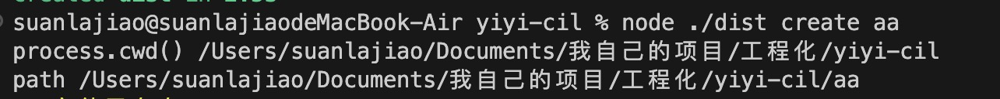

# 搭建自己的脚手架工具（一）

首先创建一个vue项目我们一般会使用`vue-cil`去创建，react的话就是使用`create-react-app`，当然除了这两种方式，还可以基于vite去创建。那有没有思考过vue-cil是如何工作的呢？

**`vue-cil`是如何工作的?**

当输入 `vue create xxx` 命令之后，`vue-cil`本身有一套预定义的项目模版，它会根据你的命令去`github`仓库拉取你需要的模版代码，拉到本地之后，最后执行`npm install`安装依赖。

## 为什么要自己开发脚手架
我们平时做业务的时候，有没有发现在公司做类似的业务，其实很多东西都是相通的，当我把一个项目搭建起来，统一封装aixos、统一构建工具的配置、统一公用的库和组件，这时候我们搭建可能是把之前做的老项目copy过来把没用的删掉再开发，这其实是重复性的东西，比较浪费时间和精力，如果能自己把通用的基础项目封装起来，每次通过命令去生成，是不是更方便更节省时间呢？

## 搭建自己的脚手架
下面就来结合个人平时在公司项目搭建的流程，封装一个基础的脚手架。

**首先确定一下构建工具**

这里采用 `rollup`， 因为我们这里主要是封装一个基础的脚手架，用它来生成项目模板，`rollup`打出的包比较干净简洁，而webpack更适合业务项目的生产环境的构建。

**1. 创建一个文件目录 `yiyi-cil`**

**2. 初始化项目 `npm init -y`**

**3. 安装 typescript `npm i -D typescript`**

**4. 生成typescript配置文件 tsconfig.json `npx tsc --init`**

**5. 安装rollup相关插件**
```js
npm i -D rollup @rollup/plugin-node-resolve @rollup/plugin-commonjs @rollup/plugin-json rollup-plugin-typescript2 @rollup/plugin-terser rollup-plugin-node-externals
```

  - @rollup/plugin-node-resolve：支持rollup打包node modules模块（rollup是不会主动去处理三方依赖的，因为rollup是专注于库打包的工具，而webpack会自动处理node_modules中的依赖，因为它的设计初衷就是要提供一个全能的打包工具，适用于各种项目）
  - @rollup/plugin-commonjs：将 CommonJS 模块转换成 ES Modules 格式（rollup本身只支持ES Modules 格式）
  - @rollup/plugin-json：支持rollup打包json文件
  - rollup-plugin-typescript2：支持rollup打包ts文件
  - @rollup/plugin-terser：压缩打包代码
  - rollup-plugin-node-externals：使rollup自动识别外部依赖

**6. 配置rollup.config.js**
```js
import { defineConfig } from 'rollup';
import nodeResolve from '@rollup/plugin-node-resolve';
import commonjs from '@rollup/plugin-commonjs';
import externals from "rollup-plugin-node-externals";
import json from "@rollup/plugin-json";
import terser from "@rollup/plugin-terser";
import typescript from 'rollup-plugin-typescript2';

export default defineConfig([
  {
    input: {
      index: 'src/index.ts', // 打包入口文件
    },
    output: [
      {
        dir: 'dist', // 输出目标文件夹
        format: 'cjs', // 输出 commonjs 文件
      }
    ],
    plugins: [
      nodeResolve(),
      externals({
        devDeps: false, // 可以识别我们 package.json 中的依赖当作外部依赖处理 不会直接将其中引用的方法打包出来
      }),
      typescript(),
      json(),
      commonjs(),
      terser(),
    ],
  },
]);
```
**7. 在package.json中配置script命令，-c 指定 rollup 配置文件，--bundleConfigAsCjs 将配置转为 commonjs 执行。**

   

```json
{
  // ...
  "build": "rollup -c rollup.config.js --bundleConfigAsCjs"
}
```
**8. 根目录新建src文件夹，再建一个入口文件index.ts，编写代码。**
  - 编写执行命令，需要安装一个插件`commander`
```js
import { Command } from "commander";
import { version } from "../package.json";
// 这里我们用 yiyi 当作我的指令名称
// 命令行中使用 yiyi xxx 即可触发
const program = new Command('dawei');
const program = new Command("yiyi");

program.version(version, '-v, --version');

```
  tsconfig.json配置 这几个选项需要打开，不然会报错。
  ```json
  "module": "ESNext",
  "moduleResolution": "node",
  "resolveJsonModule": true,
  ```
   - 执行` npm run build` 打包，查看dist目录下是否生成了文件。然后执行 `node ./dist yiyi -v` 。可以看到最后输出了版本号
  
   

注意：有可能会报个错


可以看下`rollup-plugin-node-externals` `github`官网有网友给出了解决方案，把`rollup-plugin-node-externals`插件换成5.1.2版本。


**9. 封装命令，当我们使用vue-cil去创建项目的时候，使用`vue create xxx`，我也可以封装一个类似的，接下来封装这个create命令的逻辑。**

使用command与action实现自定义指令。
  - command 为我们需要的命令名称。
  - description 为命令添加描述。
  - action 为指令触发执行的回调。
  - argument 为我们命令需要的参数，[]包裹代表可选，<>包裹代表必填。
  - action 回调中会将 argument 中的参数传入
```js
import { Command } from "commander";
import { version } from "../package.json";
import { create } from "./command/create";

const program = new Command("yiyi");

program.version(version, '-v, --version');

program
  .command('create')
  .description('创建一个新项目')
  .argument('[name]', '项目名称')
  .action(async (name) => {
    create(name)
  });

// parse 会解析 process.argv 中的内容
// 也就是我后面要输入的指令
program.parse();
```
**10. 封装create逻辑**

在src目录下新建command文件夹，新建create.ts文件。
在写之前需要先安装几个插件：
  - progress-estimator：终端加载条动画
  - chalk：终端字体美化
  - @inquirer/prompts：终端输入交互
  
具体用法查一下官网，这些依赖都是看`create-react-app`源码知道的。

在src/command/create.ts文件下编写create命令核心代码。

导出一个可以传入项目名称的方法，如果用户直接传入了项目名称则让用户选择模板，否则需要先让用户输入项目名称。

这里我们用到了`@inquirer/prompts`，可以帮助我们让用户在终端进行输入或选择的操作，更多使用方法请查阅官方文档：`https://github.com/SBoudrias/Inquirer.js`。

```js
import { input, select, confirm } from "@inquirer/prompts";

export async function create(projectName?: string) {
  if (!projectName) {
    projectName = await input({
      message: "请输入项目名称：",
    });
  }
}
```
输入名称之后还需要判断当前目录下是否包含同样名称的项目，如果包含的话询问要是否覆盖，在src/command/create.ts添加一个判断用户是否覆盖的公共方法：
```js
export const isOverwrite = async (fileName: string) => {
  console.warn(`${fileName} 文件已存在 !`);
  return select({
    message: "是否覆盖原文件: ",
    choices: [
      { name: "覆盖", value: true },
      { name: "取消", value: false },
    ],
  });
};
```

```js
import { input, select, confirm } from "@inquirer/prompts";
import path from "path";
import fs from "fs-extra";

export async function create(projectName?: string) {
  if (!projectName) {
    projectName = await input({
      message: "请输入项目名称：",
    });
  }
}

const filePath = path.resolve(process.cwd(), projectName);
//是否存在同名文件或文件夹
if (fs.existsSync(filePath)) {
  const run = await isOverwrite(projectName);
  if (run) {
    // 覆盖文件，先删除再创建
    await fs.remove(filePath);
  } else {
    return; // 不覆盖直接结束
  }
}
```
`process.cwd()` 当前工作目录的绝对路径，它表示 `Node.js` 进程启动时的目录。通过 `process.cwd()` 获取当前工作目录，然后与 `projectName` 拼接，确保 `filePath` 是一个绝对路径。


