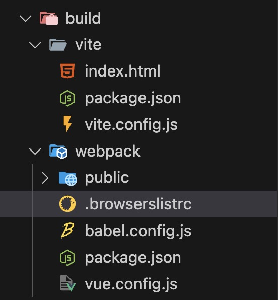
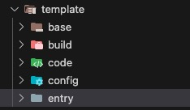

# 搭建自己的脚手架工具（二）

前面我们已经完成了基础的架子，接下来是核心部分。需要让用户选择我们的预设模板，你可以提供一套基础模版，也可以提供多个。

以下是我以自己平时在公司做的业务模板为例，我将提取出平时业务开发公共的部分组成一个`base`模版，然后提供构建工具（vite、webpack）、是否引入 `vue-router`、是否引入 `pinia` 的选择。新开发的项目统一使用 `vue3+pinia`，不再提供`vuex`的选择。

另外下载模板的方式有很多种，可以将模板文件保存在 SDK 中，使用 fs 模块写入，或者存放在 git 仓库中进行 clone，这里我直接将模版集成到脚手架里，用fs模块写入。

## 在src下新建template目录
### base模版
将公共的配置文件和目录抽离到`tempalte->base`下，这里大家根据自己公司的业务来添加哈。


这里我还添加了一些我平时业务中常用的`eslint`、`stylelint`、提交规范等，还有基本的`css`样式的配置。

### 在`template->build`下增加webpack、vite目录



webpack使用的是`vue-cil`集成工具，添加了babel和.browserslistrc文件（用于配置浏览器兼容性），也可以直接写在package.json中。

babel.config.js
```js
module.exports = {
  presets: [
    '@vue/cli-plugin-babel/preset'
  ]
}
```
.browserslistrc
- `> 1%`：支持全球市场中使用量超过 1% 的浏览器。
- `last 2 versions`：支持每个浏览器的最新两个版本。
- `not dead`：排除已经不再维护或使用率极低的浏览器。
- `not ie 11`：明确不支持 Internet Explorer 11。

vue.config.js
```js
const { defineConfig } = require('@vue/cli-service')

function getBaseURL() {
  let baseURL = ''
  const deployEnv = process.env.DREAMENV
  const date = new Date()
  const prefix = `${process.env.CI_PROJECT_NAME}/${
    date.getFullYear()}${`0${date.getMonth() + 1}`.slice(-2)}${`0${date.getDate()}`.slice(-2)}`
  switch (deployEnv) {
    case 'TEST':
      baseURL = process.env.TEST_RESOURCE_DOMAIN + prefix
      break
    case 'PROD':
      baseURL = process.env.PROD_RESOURCE_DOMAIN + prefix
      break
    default:
      baseURL = process.env.NODE_ENV === 'production' ? './' : '/'
      break
  }
  return baseURL
}

module.exports = defineConfig({
  publicPath: getBaseURL(),
  transpileDependencies: true
})
```
`vite.config.js配置是一样的，只不过语法不同`

这个配置主要是根据不同的部署环境，动态设置 Vue 项目的 publicPath，即资源的基路径。里面process.env.xx是通过CI/CD设置的一些环境变量，忽略即可，根据自己的业务来。

### router和pinia的模版配置

如果选择了router和pinia 主要涉及到 `需要在main.js中引入`、`还有router和store目录的新增`、`package.json的依赖添加`。

`template` 目录下新增 code、config、entry目录。



`code` 目录下存放的是defualt单页面和router目录下对app.vue的改写以及router、views目录的新增：


router下的App.vue
```html
<template>
  <nav>
    <RouterLink to="/">Home</RouterLink>
    <RouterLink to="/about">About</RouterLink>
  </nav>
  <RouterView />
</template>

<script setup>
import { RouterLink, RouterView } from 'vue-router'
</script>

<style lang="less" scoped>
</style>
```
`config` 目录下存放的是 `package.json` 的配置，还有store目录的新增，并且给了一个`counter.js`的初始化例子：


`entry` 目录下存放的是对 `main.js`的配置，有四种：默认的、选择了router、选择了pinia、两个都选了。


这里展示下`router-and-pinia->src` 下的main.js
```js
import '@/assets/css/index.less'

import { createApp } from 'vue'
import { createPinia } from 'pinia'

import App from './App.vue'
import router from './router'

const app = createApp(App)

app.use(createPinia())
app.use(router)

app.mount('#app')
```

这里`template`模版基本上就配置完了，接下来就是写命令选择，并调用`startCreate`的逻辑了。

src/command/create.ts
```js
import { input, select, confirm } from "@inquirer/prompts";
import path from "path";
import fs from "fs-extra";
import { render } from "../utils/clone";
import chalk from "chalk";

export async function create(projectName?: string) {
  //判断文件覆盖
  ...

  //先初始化一个新的项目结构，并添加了package.json文件
  const targetRoot = path.resolve(process.cwd(), projectName);
  fs.mkdirSync(targetRoot);
  const pkg = { name: projectName, version: "0.0.0" };
  fs.writeFileSync(
    path.resolve(targetRoot, "package.json"),
    JSON.stringify(pkg, null, 2)
  );

  // 构建工具的选择
  const buildToolName = await select({
    message: "请选择构建工具：",
    choices: [
      {
        name: "vite",
        value: "vite",
      },
      {
        name: "webpack",
        value: "webpack",
      },
    ],
  });

  const isNeedRouter = await confirm({ message: "是否引入 Vue-Router?" });
  const isNeedPinia = await confirm({ message: "是否引入 Pinia?" });

  try {
    // 把选择的结果传递给startCreate函数
    await logger(
      startCreate(buildToolName, isNeedRouter, isNeedPinia, projectName),
      "代码下载中...",
      {
        estimatedDuration: 7000,
      }
    );
    console.log(chalk.green(`${projectName}下载成功`));
    console.log(chalk.blueBright(`==================================`));
    console.log(chalk.blueBright(`=== 欢迎使用 yiyi-cli 脚手架 ===`));
    console.log(chalk.blueBright(`==================================`));
    console.log();
    console.log(`  ${chalk.green(`cd ${projectName}`)}`);
    console.log(`  ${chalk.green("npm install")}`);
  } catch (error) {
    console.error(chalk.red(`${projectName}下载失败`));
    console.log(error);
  }
}

```

这里使用了`@inquirer/prompts`库的`select`和`confirm`方法来让用户选择构建工具、是否引入 Vue-Router 和 Pinia。

添加一个显示进度的函数，我这里用的是`progress-estimator`库，可以显示一个进度条，然后使用`chalk`库来着色。
```js
const createLogger = require("progress-estimator");

const logger = createLogger({
  spinner: {
    interval: 100,
    frames: ["⠋", "⠙", "⠹", "⠸", "⠼", "⠴", "⠦", "⠧", "⠇", "⠏"].map((item) => {
      return chalk.green(item); //默认是白色所以需要chalk来着色
    }),
  },
  format: {
    prefixText: chalk.green("Git"),
    successText: chalk.green("✔︎"),
    errorText: chalk.red("✖"),
  },
});
```
然后添加一个`startCreate` 开始创建模板的函数，引入utils/clone.ts里的render方法。

```js
function startCreate(
  buildToolName: string,
  isNeedRouter: Boolean,
  isNeedPinia: Boolean,
  projectName: string
) {
  render("base", projectName);
  // build tool
  if (buildToolName === "vite") {
    render("build/vite", projectName);
  } else {
    render("build/webpack", projectName);
  }
  // entry main.js的配置
  if (isNeedRouter && isNeedPinia) {
    render("entry/router-and-pinia", projectName);
  } else if (isNeedRouter) {
    render("entry/router", projectName);
  } else if (isNeedPinia) {
    render("entry/pinia", projectName);
  } else {
    render("entry/default", projectName);
  }
  // config package.json
  if (isNeedRouter) {
    render("config/router", projectName);
  }
  if (isNeedPinia) {
    render("config/pinia", projectName);
  }
  // code
  if (isNeedRouter) {
    render("code/router", projectName);
  } else {
    render("code/default", projectName);
  }
}
```

src下新建utils目录，新增三个文件：


clone.ts
```js
import path from "path";
import { fileURLToPath } from "url";
import {
  statSync,
  mkdirSync,
  readdirSync,
  existsSync,
  readFileSync,
  writeFileSync,
  copyFileSync,
} from "fs-extra";
import sortDependencies from "./sort-dependencies";
import deepMerge from "./deep-merge";

function renderTemplate(templatePath: string, filePath: string) {
  const stats = statSync(templatePath);
  if (stats.isDirectory()) {
    if (path.basename(templatePath) === "node_modules") {
      return;
    }

    mkdirSync(filePath, { recursive: true });
    for (const file of readdirSync(templatePath)) {
      renderTemplate(
        path.resolve(templatePath, file),
        path.resolve(filePath, file)
      );
    }
    return;
  }
  const filename = path.basename(templatePath);

  if (filename === "package.json" && existsSync(filePath)) {
    const existing = JSON.parse(readFileSync(filePath, "utf8"));
    const newPackage = JSON.parse(readFileSync(templatePath, "utf8"));
    const pkg = sortDependencies(deepMerge(existing, newPackage));
    writeFileSync(filePath, JSON.stringify(pkg, null, 2) + "\n");
    return;
  }

  if (filename.startsWith("_")) {
    // 重命名 `_file` to `.file`
    filePath = path.resolve(
      path.dirname(filePath),
      filename.replace(/^_/, ".")
    );
  }
  copyFileSync(templatePath, filePath);
}

export function render(templateName: string, projectName: string) {
  const templateRoot = fileURLToPath(
    new URL("../src/template", import.meta.url)
  );
  const templatePath = path.resolve(templateRoot, templateName);
  renderTemplate(templatePath, path.resolve(process.cwd(), projectName));
}
```

**render函数**
- `import.meta.url` 提供的是文件的 URL 格式（比如 file:///path/to/file），而不是路径字符串。
- `new URL` 创建了一个新的 URL对象 并指向 `src/template` 文件夹。
- `fileURLToPath` 将 URL 转换成文件系统路径，
- `path.resolve` 将转换后的 templateRoot 路径和模板文件名合并，得到完整的文件路径，例如：`/Users/suanlajiao/Documents/xxxxxxxx/yiyi-cil/src/template/code/router`。


得到模版的绝对路径和新项目的绝对路径之后，再传入`renderTemplate`

先解释一下这几个文件操作方法：
- `statSync(path)` 同步读取文件或目录的状态信息，比如是否是目录、文件大小、修改时间等。
- `mkdirSync(path, options)` 同步创建一个目录，第二个参数通常包括 { recursive: true }，表示递归创建多层目录。
- `readdirSync(path)` 同步读取指定目录中的文件和子目录，返回一个包含该目录下文件和子目录名称的数组。
- `existsSync(path)` 同步检查文件或目录是否存在，返回值是一个布尔值
- `readFileSync(path, encoding)` 同步读取文件内容，第二个参数是指定文件的编码格式，不传的话默认返回`Buffer`类型，返回值为文件的内容。
- `writeFileSync(path, data, options)` 同步写入数据到文件，data为要写入文件的数据，options配置项，通常包括 encoding（默认为 utf8）和 mode（文件权限设置）。
- `copyFileSync(src, dest)` 同步复制文件。src为源文件路径，dest为目标文件路径，无返回值，如果目标文件已存在会被覆盖。

**renderTemplate函数**

里面分三步：
第一步，判断是不是目录，如果是就调用 `mkdirSync` 创建目标目录，{ recursive: true } 确保递归创建多层目录，有两个参数，然后readdirSync 读取该模版路径下的所有文化，遍历进行递归处理。

第二步，判断是不是`package.json`，如果是就读取目标项目中的package.json和模版中待合并的`package.json`，合并后把里面的依赖按字母进行排序写入到目标路径。

第三步，重命名 `_file` to `.file`，最后复制文件到目标路径。

deep-merge.ts，将目标项目中的`package.json`与模版里待合并的`package.json`进行深度合并。
```js
const isObject = (val: any) => val && typeof val === "object";
const mergeArrayWithDedupe = (a: any, b: any) =>
  Array.from(new Set([...a, ...b]));

function deepMerge(target: { [key: string]: any }, obj: { [key: string]: any }) {
  for (const key of Object.keys(obj)) {
    const targetVal = target[key];
    const newVal = obj[key];

    if (Array.isArray(targetVal) && Array.isArray(newVal)) {
      target[key] = mergeArrayWithDedupe(targetVal, newVal);
    } else if (isObject(targetVal) && isObject(newVal)) {
      target[key] = deepMerge(targetVal, newVal);
    } else {
      target[key] = newVal;
    }
  }

  return target;
}

export default deepMerge;
```

sort-dependencies.ts， 将dependencies、devDependencies、peerDependencies、optionalDependencies 按照字母顺序排序。
```js
interface PackageJson {
  dependencies?: Record<string, string>;
  devDependencies?: Record<string, string>;
  peerDependencies?: Record<string, string>;
  optionalDependencies?: Record<string, string>;
  [key: string]: any; // 允许其他额外的属性
}
function sortDependencies(packageJson: PackageJson) {
  const sorted: Partial<PackageJson>= {};

  const depTypes: (keyof PackageJson)[] = [
    "dependencies",
    "devDependencies",
    "peerDependencies",
    "optionalDependencies",
  ];

  for (const depType of depTypes) {
    if (packageJson[depType]) {
      sorted[depType] = {}

      Object.keys(packageJson[depType])
        .sort()
        .forEach((name) => {
          sorted[depType][name] = packageJson[depType][name];
        });
    }
  }

  return {
    ...packageJson,
    ...sorted,
  };
}

export default sortDependencies;
```

至此，已经完成了`cil`的创建项目基本功能，后续可以添加自动安装依赖的功能，还有如何发布。